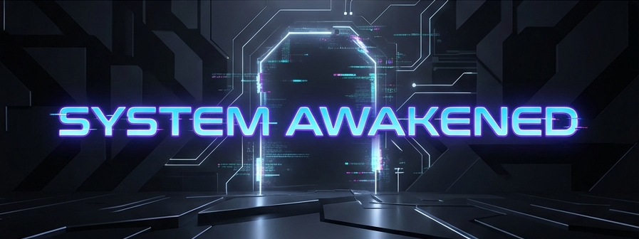

<h1 align="center">Dingaan Manjate</h1>

  

 <b>"I don't just write code; I devour complexity."</b>

 

##  ****Cloud Engineer****

> *"Leveraging the cloud to expand infrastructure limits."*

I specialize in building scalable, resilient cloud architectures. I tackle infrastructure challenges with precision and automate the chaos out of existence.

---

### 🛠️ **Tech Stack**

| **Category** | **Skills** |
| :--- | :--- |
| **Cloud** |    |
| **DevOps** |    |
| **Code** |         |
| **Tools** |    |

---

### 📜 **Certifications**

| **Issuer** | **Credential** |
| :--- | :--- |
| **Coursera** |          |
| **Project-Y** |          |

---

 

  "The only way to survive is to evolve."
   
  <b>Let's build something great together.</b>

  
  

